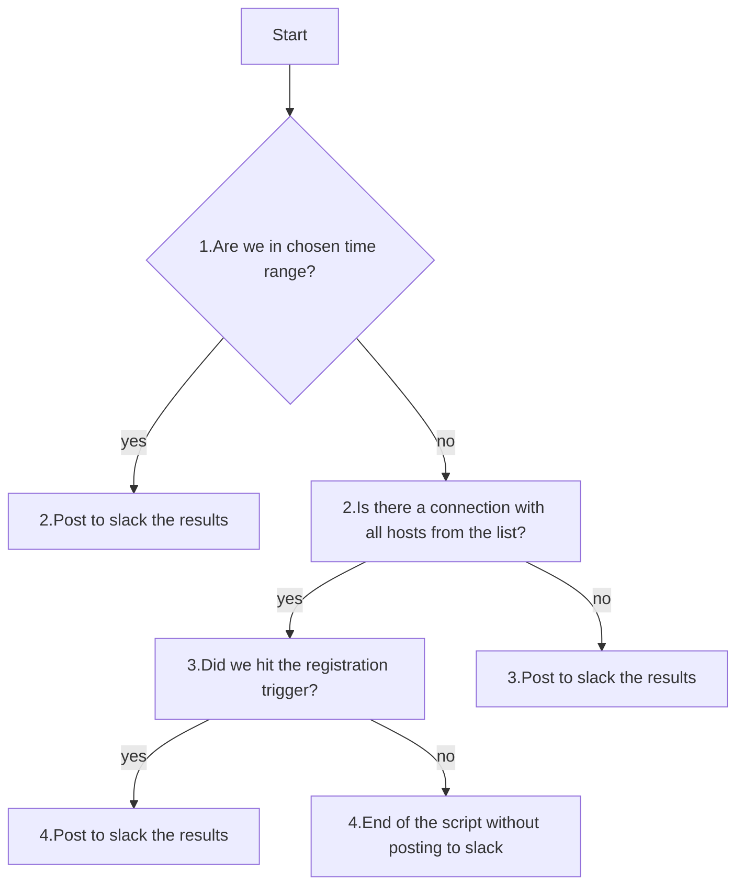

***1)#####################General info:#########################***
 
Sansays are VoIP SBC. 

Sometimes there is no way to receive the subscriber's registrations information from CLI. This script imitates user's actions by using Selenium.

Scripts can be set via crontab. 

In script itself, you can pick the time range window. If scripts starts during this time range, it will send results to slack.
If you're out of the chosen time range, the script checks the connection to hosts and checks the registration triggers you manually set. In case something is wrong, it'll notify you in your slack.

Script creates logs in the folder of the script.

<!-- blank line -->
----

***2)#####################Script logic:#########################*** 

